# DevOps IoT Edge Module

Azure DevOps has IoT Edge task template so that it is easy to configure CI/CD pipelines.
One caveat is that you need ARM32 platform to build module for ARM32v7, but Azure DevOps hosted agent doesn't provide the platform.

There are two workarounds.

- Use ARM32 device such as Raspberry Pi as your build agent
- Use Linux VM with ARM32 emulator and use it as your build agent

# Create Self-hosted build agents for ARM32v7 platform

To create your Self-hosted agents, 

1\. Provision Ubuntu VM.

```shell
$Resource_Group_Name="IoTEdgeSampleRG"
$Location="eastus"
# Create Linux VM Build Agent
az vm create --name IoTEdgeBuildAgent --resource-group $Resource_Group_Name --location $Location --image UbuntuLTS --size Standard_DS2_v2
```

2\. Use the [SetupDevOpsAgent.sh](./SetupDevOpsAgent.sh) to install required components.

These steps are taken from following source page.

- [Manual Dev Machine Setup](https://github.com/Azure/iotedgedev/wiki/manual-dev-machine-setup)
- [Run docker service](https://docs.docker.com/install/linux/linux-postinstall/#manage-docker-as-a-non-root-user)
- [ARM32v7 emulator](https://stackoverflow.com/questions/56063608/error-running-docker-build-for-arm32v7-container-on-amd64-linux-machine-standar)

3\. Register the VM to your Azure DevOps custom agent by following [Self-hosted Linux agents](https://docs.microsoft.com/en-us/azure/devops/pipelines/agents/v2-linux?view=azure-devops) page.

# Continuous Integration

CI part will:

- Compile the IoT Edge module and build docker container for specific platform.
- Push the container to container registry

1\. Create new build pipeline and start empty job.

2\. Change the Agnet pool to your self-hosted pool.

3\. Add "Azure IoT Edge" task. 
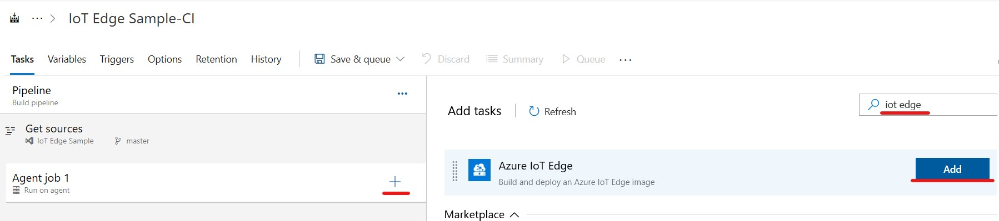

4\. Change "Default platform" to "arm32v7".
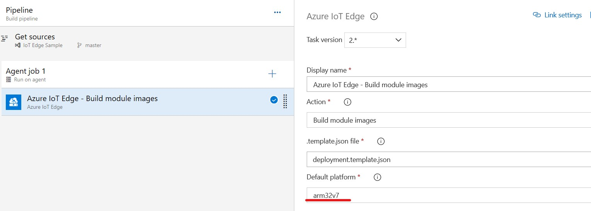

5\. Add another "Azure IoT Edge" task and select "Push module images" action. You need to specify your Container Registry information.
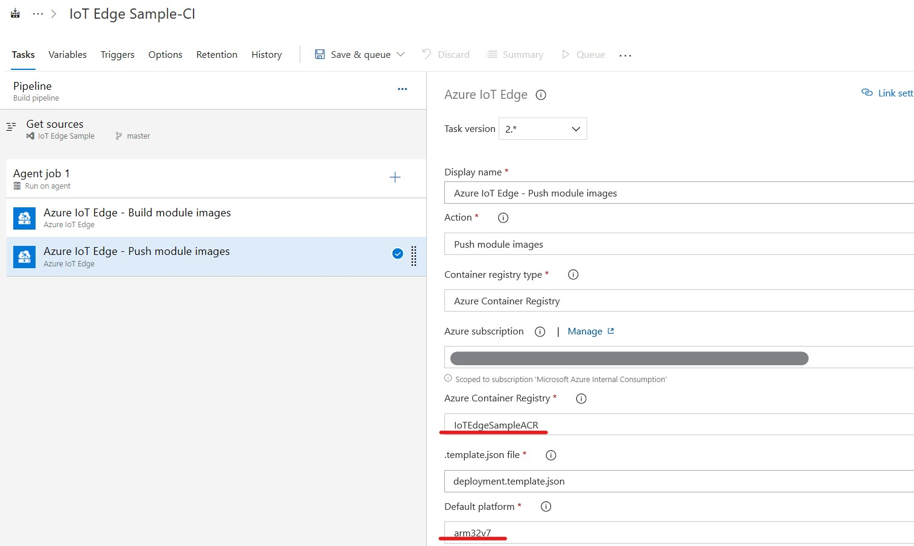

6\. Add "Copy files" task and copy "deployment.template.json" and all module.json files to $(Build.ArtifactStagingDirectory)
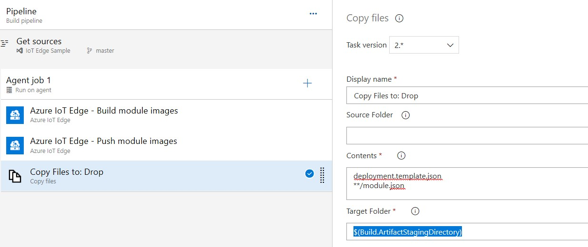

7\. Add "Publish build artifacts" task and leave the options as default.
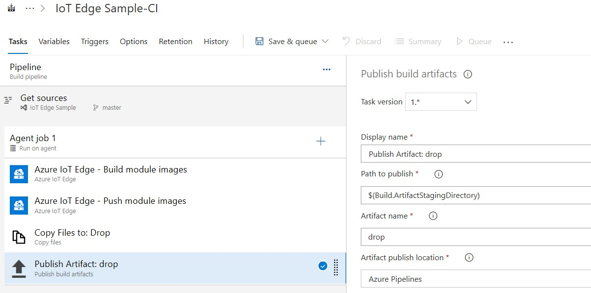

8\. Save and queue the build for test. Once build completed, you can see the container on your container registory and drop artifacts.

9\. Once you confirmed the success of the build, change the trigger to enable CI.
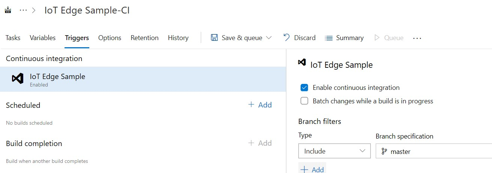

# Continuous Deployment

CD part will: 

- Generate the deployment manifest
- Push the build deployment manifest to IoT Hub

1\. Create new release pipeline by using "Empty job".

2\. Add an artifact from build pipeline.
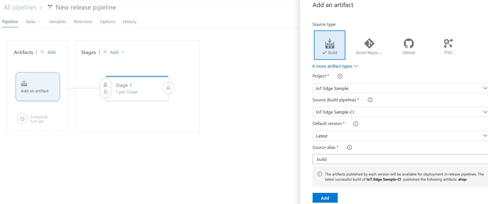

3\. Add "Azure IoT Edge" task and select "Generate deployment manifest" task. Select template.json from drop folder and select ARM32v7 as default platform.
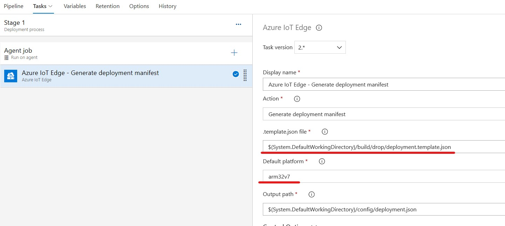

4\. Add "Azure IoT Edge" task and select "Deploy to IoT Edge devices" task. Specify your IoT Hub. You can sepecify "Single Device" or "Multiple Devices" as target. 
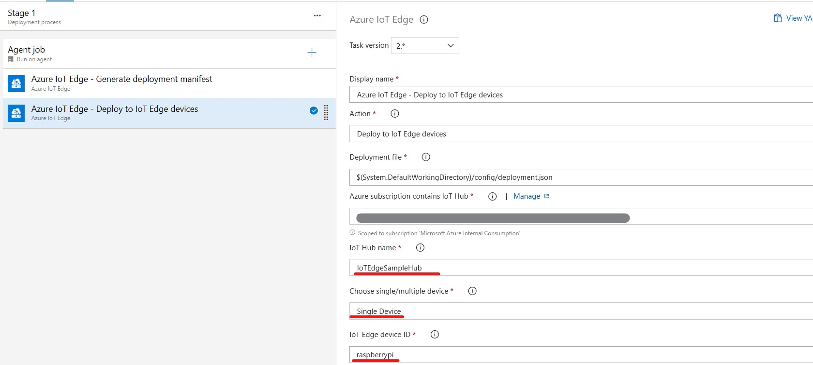

5\. Add Variables. See [.env](../IoTEdge/.env) file for necessary variables.
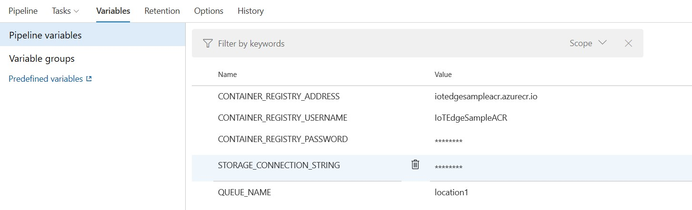

6\. Save and create release for test. Once release completed, you can see the deployment manifest is applied to the specified IoT Edge Device in IoT Hub.

7\. Once you confirm the success of release, change the triger to CD.
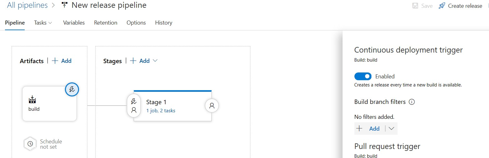