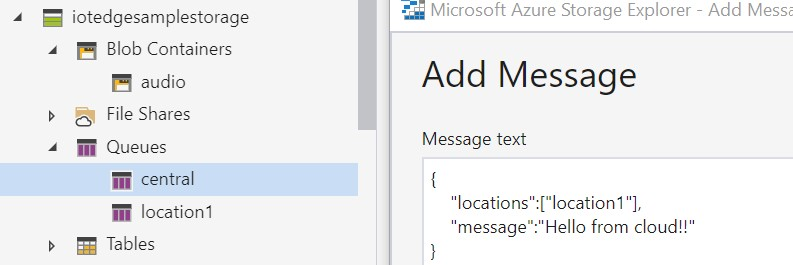

# Dispatch Voice Message to IoT Edge

This repositry contains sample applications and documentations to illustrate how to dispatch voice message to IoT Edge devices from cloud.

# Scenario

This sample covers following scenario.

- Dispatch a voice message to locations such as stores, shops, rooms from central place.

This repositry also provdes information about how to DevOps IoT Edge module to physical devices.

# Technologies

This sample uses following technologies. 

Microsoft Technologies
- [Azure IoT Edge](https://azure.microsoft.com/en-us/services/iot-edge/)
- [Azure IoT Hub](https://azure.microsoft.com/en-us/services/iot-hub/)
- [Azure Cognitive Services](https://azure.microsoft.com/en-us/services/cognitive-services/)
- [Azure Container Registry](https://azure.microsoft.com/en-us/services/container-registry/)
- [Azure Functions](https://azure.microsoft.com/en-us/services/functions/)
- [Azure Blob Storage](https://azure.microsoft.com/en-us/services/storage/blobs/)
- [Azure Queue Storage](https://azure.microsoft.com/en-us/services/storage/queues/)
- [Azure DevOps](https://azure.microsoft.com/en-us/services/devops/)

Other technologies
- [Raspberry Pi Device](https://www.raspberrypi.org/)
- [Docker](http://www.docker.com)

# Architecture 

The solution is build on [Cloud-Native applications](https://azure.microsoft.com/en-us/overview/cloudnative/) concept, that each component is loosly-coupled and based on managed services.


This repositry consist of following components.

# Azure Resource Provisioning

[Setup](./Setup) folder contains Azure CLI base commands to setup necessary Azure resources. 

# Azure Function app

[Dispatcher](./Dispatcher) folder contains Azure Function sample app which covers step 2, 3, 4 in the architecture diagram.

# IoT Edge Module

[IoTEdge](./IoTEdge) folder contains IoT Edge module sample which covers step 5 in the architectre diagram

# IoT Edge Module DevOps

[DevOps](./DevOps) folder contains information about IoT Edge module DevOps especially for ARM32v7 devices such as Raspberry Pi. 

# What is missing?

## Create Queue Item to Central Queue

I didn't provide sample application to create a queue message to the central queue. In the real-world scenario, you may need to integrate this part into existing system, or need to create new service as Web API, Native-Client app, etc. Refer to Azure Queue documentation for how to create an application to work with Queues. 

For testing, you can simply use [Azure Storage Explorer](https://azure.microsoft.com/en-us/features/storage-explorer/) to create queue item directly. 

Use following format when sending test data.

```
{
    "locations":["location1"],
    "message":"Hello from cloud!!"
}
```


## Application Insight

To simply the sample, I didn't include Application Insight. For production, use Application insights where you can so that it is easy to monitor by using Azure Monitor. See [Azure Monitor](https://azure.microsoft.com/en-us/services/monitor/) for more information.

# License

[MIT License](./LICENSE) 